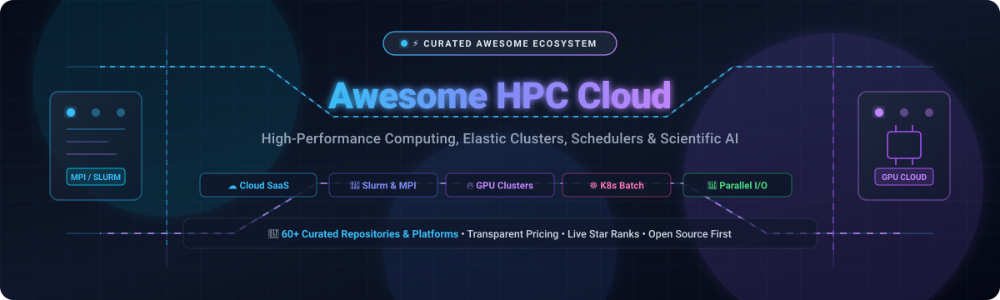
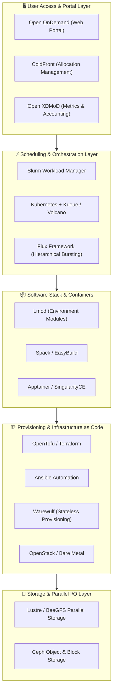

# Awesome High-Performance Computing (HPC) Cloud ⚡

  

  
  
  
  
  
  
  

---

## 🌐 Top High-Performance Computing (HPC) Cloud Ecosystem

> 🚀 **A curated directory of top-tier SaaS platforms, hyperscale cloud supercomputing services, and active open-source GitHub projects for Cloud High-Performance Computing (HPC), Elastic Cluster Provisioning, AI/ML Infrastructure, Workload Schedulers, and Distributed Scientific Computing.**
>
> 📅 **Last updated:** August 2026

---

### 🔍 Quick Navigation & Table of Contents

* [📊 Market Overview & Industry Structure](#-market-overview--industry-structure)
* [☁️ SaaS & Hosted HPC Platforms](#️-saashosted-hpc-platforms)
* [🏢 Hyperscalers & Specialized GPU/AI Cloud Providers](#-hyperscalers--specialized-gpuai-cloud-providers)
* [🛠️ Open-Source GitHub Projects (Ranked by Stars)](#️-open-source-github-projects-ranked-by-stars)
  * [Top Open-Source Core HPC Repositories](#top-open-source-core-hpc-repositories)
  * [Key HPC Ecosystem Frameworks & Libraries](#key-hpc-ecosystem-frameworks--libraries)
* [🏗️ Reference Blueprint: Self-Hosted HPC Cloud Architecture](#️-reference-blueprint-self-hosted-hpc-cloud-architecture)
* [🤝 How to Contribute](#-how-to-contribute)
* [📈 Star History](#-star-history)
* [⚖️ Disclaimer & License](#️-disclaimer--license)

---

## 📊 Market Overview & Industry Structure

> 💡 **Estimated Market Size (2026):** The Global Cloud High-Performance Computing (HPC) market is valued at **~$50.8 Billion in 2026** and is projected to surpass **$92.4 Billion by 2031**, expanding at a compound annual growth rate (**CAGR of ~14.2%**).
>
> 🧩 **Market Fragmentation & Competitive Dynamics:** The sector is **moderately fragmented**:
> * **Raw Compute Infrastructure Layer (Concentrated / Oligopoly):** Hyperscalers like Microsoft Azure, Google Cloud, Amazon Web Services (AWS), and Oracle Cloud dominate elastic compute, InfiniBand networking, and planetary data centers.
> * **Accelerated GPU / Bare-Metal Layer (Emerging & Competitive):** Specialized GPU clouds like CoreWeave and Lambda have captured significant market share for LLM training and heavy AI acceleration.
> * **CAE / Simulation & Orchestration SaaS Layer (Highly Fragmented):** Independent software vendors and simulation SaaS platforms (e.g., Rescale, Altair, Simr/UberCloud) compete actively on multi-cloud orchestration, workflow automation, simulation licensing, and domain-tailored developer experience.

---

## ☁️ SaaS/Hosted HPC Platforms

*Platforms are sorted in descending order by parent company valuation, market capitalization, or total estimated enterprise value.*

| Platform | Description | Company Size / Valuation | Starting Pricing | Free Tier / Free Trial Limits |
| :--- | :--- | :--- | :--- | :--- |
| **[Azure CycleCloud](https://azure.microsoft.com/products/cyclecloud/)** 💻 | Enterprise HPC cluster orchestration and scheduler management (Slurm, PBS Pro, LSF, Grid Engine) on Microsoft Azure. | **~$3.1 Trillion** *(Market Cap)* / $245B+ Annual Revenue | **$0** software license; underlying Azure compute starts at **$0.0104/hr** (B1s VM) or **$0.096/hr** (D2s v5) | 🎁 **Azure Free Account:** **$200 credit** for 30 days + **12 months free access** to 750 hrs/month of B1s VMs + 55+ always-free services |
| **[Google Cloud HPC Toolkit](https://cloud.google.com/hpc-toolkit)** ⚡ | Modular blueprint engine for deploying turnkey, repeatable HPC environments and Slurm clusters via Infrastructure-as-Code. | **~$2.1 Trillion** *(Market Cap)* / $350B+ Annual Revenue | **$0** toolkit fee; underlying GCP compute starts at **$0.0084/hr** (`e2-micro`) or **$0.0336/hr** (`e2-standard-2`) | 🎁 **GCP Free Tier:** **$300 credit** for 90 days + **Always Free tier** (1 `e2-micro` VM with 1 GB RAM & 30 GB standard disk/month) |
| **[AWS ParallelCluster](https://aws.amazon.com/hpc/parallelcluster/)** ☁️ | AWS-native open-source cluster management framework for deploying and auto-scaling Slurm and batch HPC workloads. | **~$2.0 Trillion** *(Market Cap)* / $600B+ Annual Revenue | **$0** software fee; underlying AWS compute starts at **$0.0104/hr** (t3.micro) or **$0.0416/hr** (t3.medium) | 🎁 **AWS Free Tier:** **750 hrs/month** of t2.micro or t3.micro instances for **12 months** + 5 GB Amazon S3 storage |
| **[Altair One](https://altair.com/altair-one)** 🔬 | Enterprise cloud portal for CAE multiphysics simulation, HPC solvers, and distributed computing powered by Altair Units. | **~$3.8 Billion** *(Market Cap / $10.6B Acquisition)* / $630M Revenue | Starts at **~$1,500/year** for base Altair Units (AU) license pack (**~$0.10–$0.50/AU-hr** for cloud solver bursts) | ⏱️ **14-day free trial** with full portal access to Altair simulation solvers, data analytics, and modeling applications |
| **[Penguin Solutions (POD)](https://www.penguinsolutions.com/)** 🐧 | HPC and AI bare-metal infrastructure provider offering on-demand clusters, Scyld software, and managed supercomputing. | **~$1.6 Billion** *(Market Cap - Nasdaq: PENG)* / $1.4B Revenue | Starts at **~$0.10/core-hour** for bare-metal CPU compute nodes (**~$1.50/GPU-hour** for accelerated instances) | ⏱️ **30-day proof-of-concept trial** with **500–1,000 core-hours** upon technical consultation and sales qualification |
| **[Rescale](https://rescale.com/)** 🚀 | Full-stack HPC SaaS platform for engineering simulation, scientific computing, AI/ML, and multi-cloud orchestration. | **~$1.0+ Billion** *(Valuation - Unicorn)* / $60M+ ARR | Starts at **~$0.04/core-hour** for basic compute instances + Foundation platform subscription tier | ⏱️ **5-day free trial** with up to **500 core-hours** / promotional compute credits upon evaluation request |
| **[Nimbix (JARVICE Cloud)](https://www.nimbix.net/)** 🧪 | Accelerated HPC/AI cloud platform (by Eviden/Atos) providing containerized workflows, FPGA/GPU processing, and JARVICE XE. | **~$450 Million** *(Parent Market Cap)* / ~$5B Division Revenue | Starts at **$0.15/core-hour** for CPU compute nodes; **$0.49/GPU-hour** for entry GPU instances | ⏱️ **14-day evaluation pilot** with **50–100 free core-hours** upon business request |
| **[Simr (formerly UberCloud)](https://www.ubercloud.com/)** 📦 | HPC engineering simulation platform providing turnkey containerized simulation suites across Azure, AWS, and GCP. | **~$25 Million** *(Venture Backed / Series A)* / ~$5M+ Revenue | Starts at **~$125/user/month** base platform subscription (or BYOC with cloud compute starting at **~$0.05/core-hr**) | ⏱️ **30-day free trial** for engineering teams with evaluation support and pre-configured simulation containers |
| **[HPCNow!](https://www.hpcnow.com/)** 🛠️ | Specialized managed HPC cloud operations, supercomputer cluster architecture, deployment, and optimization services. | **~$12 Million** *(Estimated Enterprise Value)* / Private | Starts at **~$100/cluster-hour** or **~$1,200/month** for managed cluster administration + underlying cloud VM costs | ⏱️ **14-day initial infrastructure assessment** and architectural proof-of-concept consultation trial |
| **[Sabalcore / Sabrewing HPC](https://www.sabrewing.com/)** ⚡ | Bare-metal scientific and engineering HPC cloud service with pre-installed scientific packages and InfiniBand networking. | **~$5 Million** *(Estimated Enterprise Value)* / Private | **$0.14/core-hour** on-demand (**$0.10/core-hour** prepaid volume pricing); includes 100 GB storage | 🎁 **Free trial** with **1,000 free core-hours** + **100 GB persistent storage** for 30 days upon sign-up |

---

## 🏢 Hyperscalers & Specialized GPU/AI Cloud Providers

*Major cloud providers and dedicated AI supercomputing fabrics delivering raw elastic infrastructure, bare-metal nodes, and specialized schedulers.*

| Platform | Description | Company Size / Valuation | Starting Pricing | Free Tier / Free Trial Limits |
| :--- | :--- | :--- | :--- | :--- |
| **[Azure HPC](https://azure.microsoft.com/solutions/high-performance-computing/)** 🌐 | High-performance compute infrastructure with HBv4/HX AMD EPYC nodes, InfiniBand interconnects, and Azure Batch scheduler. | **~$3.1 Trillion** *(Market Cap)* / $245B+ Annual Revenue | **$0** for Azure Batch scheduler; compute instances start at **$0.0104/hr** (B1s) or **$0.096/hr** (D2s v5) | 🎁 **$200 credit** for 30 days + **12 months free access** to 750 hrs/month of B1s VMs + 55+ always-free services |
| **[Google Cloud HPC](https://cloud.google.com/hpc)** 🌈 | Scalable cloud HPC infrastructure with C3/C4 compute-optimized instances, TPU/GPU pods, and Google Cloud Batch. | **~$2.1 Trillion** *(Market Cap)* / $350B+ Annual Revenue | **$0** for GCP Batch scheduler; compute instances start at **$0.0084/hr** (`e2-micro`) or **$0.0336/hr** (`e2-standard-2`) | 🎁 **$300 credit** for 90 days + **Always Free tier** (1 `e2-micro` VM with 1 GB RAM & 30 GB standard persistent storage/month) |
| **[AWS Parallel Computing Service (AWS PCS)](https://aws.amazon.com/hpc/)** 🚀 | Fully managed AWS service for creating, managing, and operating scalable Slurm-based HPC clusters on Amazon EC2. | **~$2.0 Trillion** *(Market Cap)* / $600B+ Annual Revenue | **$0.007/hr** (Small controller) + **$0.0821/hr** per node management fee + underlying EC2 (starts at **$0.0104/hr**) | 🎁 **AWS Free Tier:** 750 hrs/month of t3.micro for 12 months; AWS Activation / POC grants available up to **$300+** |
| **[Oracle Cloud HPC (OCI HPC)](https://www.oracle.com/cloud/hpc/)** 🏛️ | Bare-metal HPC compute instances with ultra-low latency 100 Gbps RoCE cluster networks, NVIDIA H100s, and dense storage. | **~$380 Billion** *(Market Cap)* / $53B+ Annual Revenue | Starts at **$0.01/OCPU-hr** (Ampere A1), **$0.04/core-hr** (standard x86), or **$10.00/GPU-hr** (NVIDIA H100) | 🎁 **Always Free tier:** 4 OCPUs & 24 GB RAM (Ampere A1) + 2 AMD VMs (1/8 OCPU, 1 GB RAM each) + 200 GB block storage; plus **$300 credit** for 30 days |
| **[CoreWeave](https://www.coreweave.com/)** 🔥 | Cloud-native GPU infrastructure platform purpose-built for massive-scale LLM training, AI inference, and VFX/rendering. | **~$19.0 Billion** *(Valuation)* / $2B+ Annual Revenue | Starts at **$0.06/vCPU-hour** or **$1.25/GPU-hour** (NVIDIA L40), **$2.70/GPU-hour** (A100 80GB), **$6.16/GPU-hour** (H100 SXM5) | ⏱️ No perpetual free tier; **Accelerator Program** grants **$10,000–$25,000** in GPU cloud credits for approved startups and researchers |
| **[Lambda (Lambda GPU Cloud)](https://lambdal.com/)** ⚡ | High-performance GPU cloud featuring 1-click clusters, NVIDIA H100/H200 nodes, zero data egress fees, and Ray integration. | **~$1.5 Billion** *(Valuation)* / $100M+ Annual Revenue | Starts at **$0.50/GPU-hour** (entry PCIe GPUs), **$1.29/GPU-hour** (A100 40GB/80GB), **$2.49/GPU-hour** (H100 PCIe) | ⏱️ No perpetual free tier; **Lambda Research Grant** provides up to **$5,000** in compute credits for academic AI/HPC research projects |

---

## 🛠️ Open-Source GitHub Projects (Ranked by Stars)

*All open-source repositories are strictly ranked in descending order by their live GitHub stargazer counts. Click on any badge to inspect its stargazers.*

### Top Open-Source Core HPC Repositories

1. ☸️ **[Kubernetes](https://github.com/kubernetes/kubernetes)** 
   Production-grade container scheduling and management platform increasingly utilized for distributed GPU orchestration, HPC batch workloads, and cloud-native scientific supercomputing.

2. 🔥 **[PyTorch](https://github.com/pytorch/pytorch)** 
   Leading open-source deep learning and tensor computing framework with optimized distributed GPU acceleration (FSDP, DDP, RPC, NCCL) for AI/HPC workloads.

3. 📊 **[Grafana](https://github.com/grafana/grafana)** 
   The open and composable observability and data visualization platform for monitoring HPC cluster health, InfiniBand fabrics, GPU metrics, and scheduler queues.

4. 🤖 **[Ansible](https://github.com/ansible/ansible)** 
   Radically simple IT automation platform used universally to provision HPC nodes, configure Slurm daemons, mount Lustre/BeeGFS filesystems, and manage software stacks.

5. 📈 **[Prometheus](https://github.com/prometheus/prometheus)** 
   Cloud Native Computing Foundation systems monitoring and time-series database powering telemetry and alerting across HPC nodes and job schedulers.

6. 🏗️ **[Terraform](https://github.com/hashicorp/terraform)** 
   Infrastructure-as-Code software tool enabling reproducible provisioning of compute clusters, VPC interconnects, GPU pools, and storage across multi-cloud environments.

7. ⚡ **[Ray](https://github.com/ray-project/ray)** 
   Unified framework for scaling AI and Python workloads, providing elastic distributed execution, hyperparameter tuning, model serving, and data batch processing.

8. 🔓 **[OpenTofu](https://github.com/opentofu/opentofu)** 
   Community-driven, open-source Infrastructure-as-Code engine (under Linux Foundation) used for declarative, vendor-neutral provisioning of HPC cloud infrastructure.

9. 💾 **[Ceph](https://github.com/ceph/ceph)** 
   Highly scalable distributed object, block, and POSIX filesystem platform delivering elastic, fault-tolerant unified storage for high-performance computing clusters.

10. 🐍 **[Dask](https://github.com/dask/dask)** 
    Flexible parallel computing library in Python providing dynamic task scheduling and big-data collections integrated seamlessly with NumPy, Pandas, and Slurm/PBS.

11. 🌌 **[SkyPilot](https://github.com/skypilot-org/skypilot)** 
    Inter-cloud compute orchestration system allowing AI/HPC workloads and batch jobs to run seamlessly across any cloud or Kubernetes cluster with automatic cost optimization.

12. 🖥️ **[Cloud-Hypervisor](https://github.com/cloud-hypervisor/cloud-hypervisor)** 
    Rust-based cloud-native Virtual Machine Monitor (VMM) optimized for modern cloud workloads, bare-metal virtualization, and low-latency confidential HPC computing.

13. ☁️ **[OpenStack](https://github.com/openstack/openstack)** 
    Open-source cloud computing infrastructure software providing bare-metal (Ironic), compute (Nova), networking (Neutron), and volume storage for private HPC clouds.

14. 🌋 **[Volcano](https://github.com/volcano-sh/volcano)** 
    Cloud-native batch scheduling engine for Kubernetes designed specifically for high-performance computing, deep learning training, big data, and scientific simulations.

15. 📦 **[Spack](https://github.com/spack/spack)** 
    Flexible, multi-platform package manager designed for supercomputers and Linux clusters, automating combinatorial builds of scientific software and compilers.

16. 🚀 **[Slurm Workload Manager](https://github.com/SchedMD/slurm)** 
    The gold standard open-source workload manager and job scheduler powering over 60% of the TOP500 supercomputers and cloud HPC clusters worldwide.

17. 🧬 **[Nextflow](https://github.com/nextflow-io/nextflow)** 
    Data-driven workflow framework enabling scalable, portable, and reproducible computational pipelines across local machines, Slurm clusters, and public clouds.

18. ⏱️ **[Kueue](https://github.com/kubernetes-sigs/kueue)** 
    Kubernetes-native job queueing controller managing multi-tenant quotas, priority preemption, and resource allocation for batch, AI, and HPC workloads.

19. 🐍 **[Snakemake](https://github.com/snakemake/snakemake)** 
    Workflow management system for reproducible and scalable data analyses, natively supporting execution across HPC batch schedulers and cloud environments.

20. 📡 **[Open MPI](https://github.com/open-mpi/ompi)** 
    High-performance, message-passing interface implementation combining technologies from FT-MPI, LA-MPI, LAM/MPI, and PACX-MPI for distributed supercomputing.

21. 📦 **[Apptainer](https://github.com/apptainer/apptainer)** 
    The premier container system for high-performance computing (formerly Singularity under Linux Foundation), engineered for unprivileged execution and native GPU/InfiniBand support.

22. 📚 **[OpenHPC](https://github.com/openhpc/ohpc)** 
    Community-driven Linux distribution stack aggregating essential HPC components, MPI libraries, compilers, schedulers, and provisioning tools for production clusters.

23. 📦 **[SingularityCE](https://github.com/sylabs/singularity)** 
    Open-source container engine designed specifically for enterprise and scientific computing workloads requiring portability and full rootless security.

24. ☁️ **[AWS ParallelCluster (OSS)](https://github.com/aws/aws-parallelcluster)** 
    AWS-supported open-source cluster management tool that simplifies deploying and managing HPC clusters on Amazon Web Services using Slurm and Elastic Fabric Adapter.

25. 📋 **[OpenPBS](https://github.com/openpbs/openpbs)** 
    Open-source high-performance workload manager and job scheduler descended from the PBS software family, optimizing job dispatching and resource utilization.

26. ⚡ **[MPICH](https://github.com/pmodels/mpich)** 
    High-performance and widely portable implementation of the Message Passing Interface (MPI) standard forming the foundation for many vendor-specific MPI libraries.

27. 🐺 **[Warewulf](https://github.com/warewulf/warewulf)** 
    Stateless and diskless container-driven operating system provisioning platform engineered for massive bare-metal and virtualized compute clusters.

28. 🧩 **[Lmod](https://github.com/TACC/Lmod)** 
    Lua-based Environment Module System from TACC supporting hierarchical software stacks, compiler families, and dynamic user environment swapping on HPC systems.

29. 🌐 **[Open OnDemand](https://github.com/OSC/ondemand)** 
    Award-winning open-source web portal providing interactive browser-based access, Jupyter notebooks, web shells, file management, and Slurm job submission.

30. 🐈 **[xCAT](https://github.com/xcat2/xcat-core)** 
    Extreme Cloud Administration Toolkit for automated bare-metal server discovery, hardware control, image deployment, and large-scale data center provisioning.

31. 🐙 **[OpenStack Magnum](https://github.com/openstack/magnum)** 
    OpenStack service providing Container-as-a-Service (CaaS) to provision Kubernetes and Docker Swarm clusters natively on private OpenStack cloud infrastructure.

32. 🛠️ **[Google Cloud Cluster Toolkit](https://github.com/GoogleCloudPlatform/cluster-toolkit)** 
    Open-source software from Google Cloud providing modular Terraform/Packer blueprints to rapidly build production HPC, AI/ML, and Slurm environments on GCP.

33. 🦅 **[HTCondor](https://github.com/htcondor/htcondor)** 
    Specialized high-throughput distributed batch scheduler designed for coarse-grained parallel computations, grid computing, and opportunistic cloud resource harvesting.

34. 📁 **[Lustre](https://github.com/lustre/lustre-release)** 
    High-performance parallel distributed file system engineered for petabyte-scale I/O throughput across tens of thousands of compute cluster nodes.

35. 🐝 **[BeeGFS](https://github.com/ThinkParQ/beegfs)** 
    Leading hardware-independent parallel cluster file system known for exceptional ease of deployment, dynamic scaling, and extreme bandwidth performance.

36. ⚡ **[Flux Framework](https://github.com/flux-framework/flux-core)** 
    Next-generation hierarchical resource management and job execution framework developed at LLNL for Exascale supercomputers and hybrid cloud bursting.

37. 🔨 **[EasyBuild](https://github.com/easybuilders/easybuild-framework)** 
    Python-based scientific software build and installation framework automating complex dependencies, optimized compilers, and module generation.

38. ❄️ **[ColdFront](https://github.com/coldfront/coldfront)** 
    Open-source allocations management system for supercomputing centers, handling resource quotas, grant tracking, project subscriptions, and Slurm user syncing.

39. 📊 **[Open XDMoD](https://github.com/ubccr/xdmod)** 
    Comprehensive HPC operational metrics and analytics engine measuring cluster utilization, wait times, CPU efficiency, and job cost accounting.

40. 🌐 **[Waldur](https://github.com/waldur/waldur-mastermind)** 
    Hybrid cloud orchestrator and self-service HPC portal providing tenant management, Slurm accounting, OpenStack integration, and multi-cloud billing controls.

41. 📦 **[StackHPC Slurm Appliance](https://github.com/stackhpc/ansible-slurm-appliance)** 
    Ansible-driven reference architecture for deploying Slurm HPC clusters with OpenTofu, OpenHPC packages, shared storage, monitoring, and Open OnDemand.

---

### Key HPC Ecosystem Frameworks & Libraries

* 🚀 **[Charm++](https://github.com/charmplusplus/charm)** — Object-oriented parallel programming framework for extreme scalability and adaptive load balancing.
* ⚡ **[Kokkos](https://github.com/kokkos/kokkos)** — C++ Performance Portability Programming Ecosystem for multi-core and accelerator architectures.
* 🛡️ **[RAJA](https://github.com/LLNL/RAJA)** — Software library enabling performance portability for C++ parallel loops on CPUs and GPUs.
* 🧵 **[Chapel](https://github.com/chapel-lang/chapel)** — High-level parallel programming language engineered specifically for productive supercomputing.

---

## 🏗️ Reference Blueprint: Self-Hosted HPC Cloud Architecture

To deploy an enterprise-grade, self-hosted, cloud-native HPC supercomputing environment, combine the following best-of-breed open-source building blocks:

---

## 🤝 How to Contribute

1. 🍴 **Fork the repository** on GitHub.
2. 🌿 **Create a feature branch** (`git checkout -b feature/new-hpc-entry`).
3. 📝 **Add or update an entry in `README.md`**:
   * For SaaS products: Include platform name, direct link, company size/valuation, specific starting pricing, and exact free tier/trial limits.
   * For Open-Source projects: Include repository link, GitHub star badge (`style=social&color=white`), concise description, and maintain strict descending star sort order.
4. 📬 **Submit a Pull Request** with a brief summary of the changes.

---

## 📈 Star History

---

## ⚖️ Disclaimer & License

* 🛡️ **Community Curated:** This repository is maintained as an open community reference list and is not directly affiliated with or endorsed by any commercial cloud provider or vendor.
* 💰 **Cost Dynamics:** Cloud HPC and GPU computing costs fluctuate depending on node shapes, accelerator types, regional availability, spot instances, data egress, and storage bandwidth. Always check the official provider pricing pages before deploying large-scale workloads.
* 📄 **License:** Licensed under the [Creative Commons Zero v1.0 Universal (CC0 1.0)](LICENSE) Public Domain Dedication.
